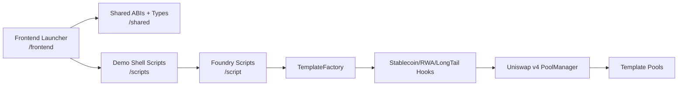
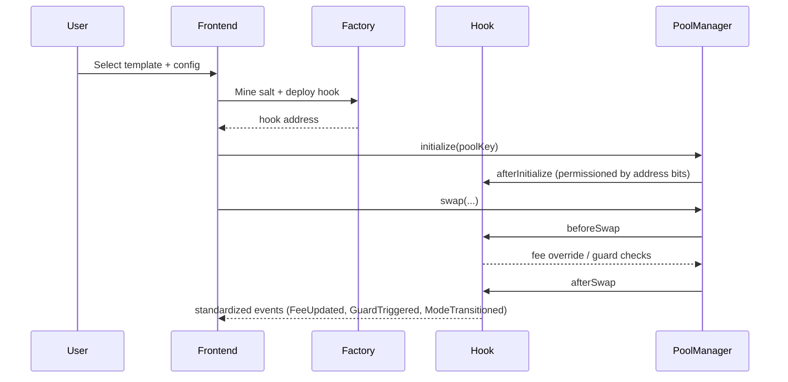
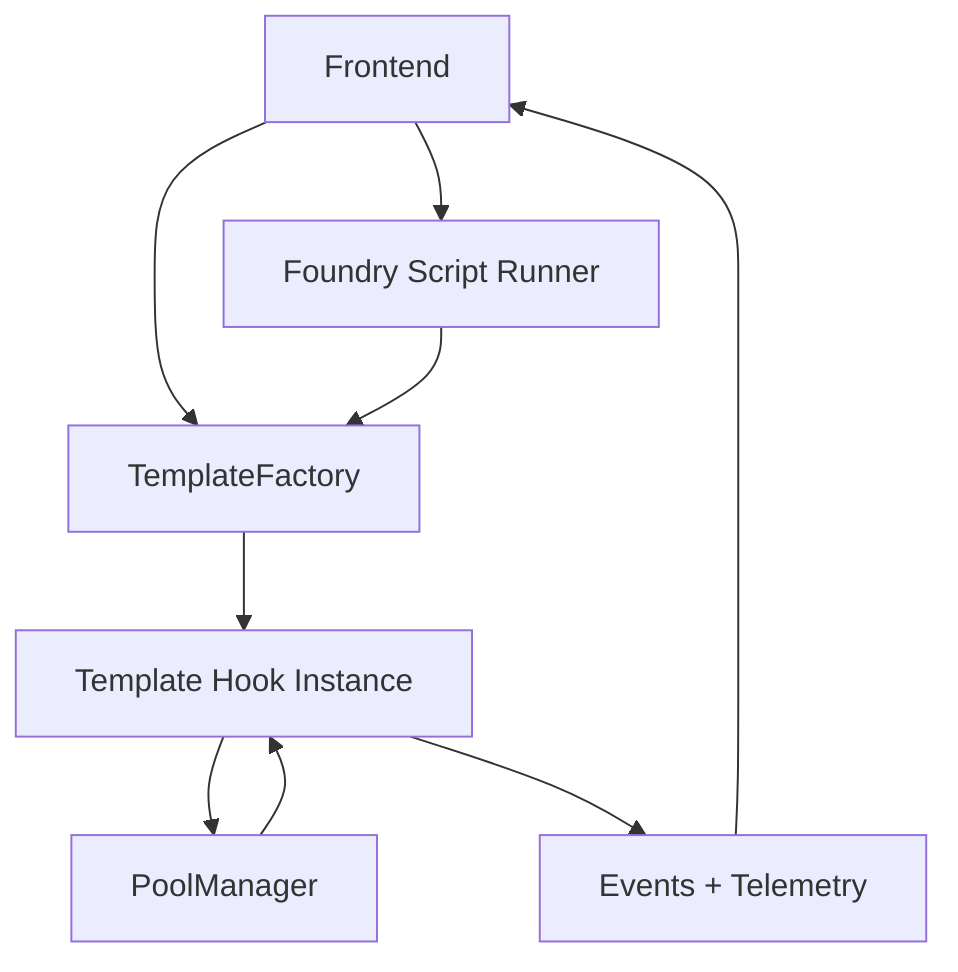

# Hook Templates: Specialized Market Hook Starter Kits


Production-oriented Uniswap v4 hook template suite for specialized markets:
- Stablecoin markets
- RWA markets
- Long-tail token markets

This monorepo ships reusable hook templates, shared guardrails/framework components, deployment/demo scripts, tests, and a React/TypeScript launcher.

## Problem
Specialized markets need policy-aware pool behavior (fees, permissions, launch controls, risk guards), but most v4 examples are single-hook and not frameworked for repeatable delivery.

## Solution
This repo provides:
- shared template framework (`src/framework`) with standardized configs/events/errors/guards
- three concrete market template hooks (`src/hooks`)
- deterministic deployment paths and demo scripts (`script`, `scripts`)
- Foundry unit/edge/fuzz/integration tests (`test`)
- frontend launcher consuming shared ABIs/types (`frontend`, `shared`)

## Architecture
### System Architecture


### Template Lifecycle


### Component Interaction


## Repository Layout
- `src/`: framework + hooks + factory + interfaces
- `test/`: unit, edge, fuzz, integration suites
- `script/`: Foundry scripts for deploy/demo
- `scripts/`: bootstrap/dependency/demo/verification shell scripts
- `frontend/`: React + Vite template launcher
- `shared/`: ABI/type/constants consumed by frontend
- `docs/`: architecture/security/testing/deployment/docs set

## Deterministic Dependencies
- Solidity dependency strategy: Git submodules under `lib/`
- Pinned v4 requirement: `lib/v4-periphery` at commit `3779387e5d296f39df543d23524b050f89a62917`
- `lib/v4-core` pinned to the exact commit referenced by that v4-periphery commit
- Node dependency strategy: single npm workspace lockfile (`package-lock.json`)

Bootstrap and verification:
```bash
make bootstrap
make verify-deps
```

## Quickstart
### 1) Install
```bash
make bootstrap
npm install
```

### 2) Build and test
```bash
make build
make test
make coverage
```

### 3) Run frontend
```bash
npm run dev --workspace frontend
```

## One-click Demo Flows
### Local (Anvil)
```bash
make demo-local
```

### Testnet (Base Sepolia default)
```bash
export RPC_URL="https://sepolia.base.org"
export PRIVATE_KEY="0x..."
make demo-testnet
```

### All
```bash
make demo-all
```

Demo scripts print transaction hashes and explorer links parsed from Foundry broadcast artifacts.

## Templates
- Stablecoin Template Hook: dynamic fee banding from peg-deviation proxy + volatility-triggered fee elevation + optional circuit-breaker-lite cooldown.
- RWA Template Hook: allowlist controls, session-window trading, strict tick/slippage guardrails.
- Long-Tail Template Hook: launch-mode fee/trade constraints with time/volume transition to normal mode and optional segmented per-block flow caps.

## Security Model
Trust assumptions:
- `PoolManager` behavior follows Uniswap v4 core invariants.
- traders/swappers/searchers are adversarial.

Implemented controls:
- `onlyPoolManager` hook entrypoint restriction
- config update admin gating with optional delay
- max trade, cooldown, rate-limit, session windows, allowlists, launch-phase restrictions
- minimal hook surface (core swap hooks) and explicit unsupported-pool rejection

This system reduces common manipulation classes but is not attack-proof.

## Documentation Index
- [spec.md](./spec.md)
- [docs/overview.md](./docs/overview.md)
- [docs/architecture.md](./docs/architecture.md)
- [docs/templates.md](./docs/templates.md)
- [docs/template-authoring-guide.md](./docs/template-authoring-guide.md)
- [docs/security.md](./docs/security.md)
- [docs/deployment.md](./docs/deployment.md)
- [docs/demo.md](./docs/demo.md)
- [docs/api.md](./docs/api.md)
- [docs/testing.md](./docs/testing.md)
- [docs/frontend.md](./docs/frontend.md)

## Assumptions
The requested `/context/uniswap/**` and `/context/atrium/**` documents were not present in this workspace. Implementation is reconciled against local pinned `lib/v4-core` + `lib/v4-periphery` sources.
