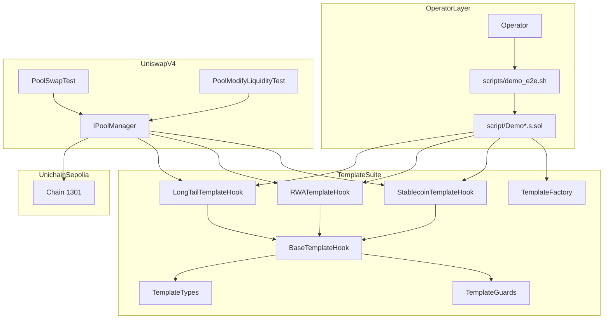
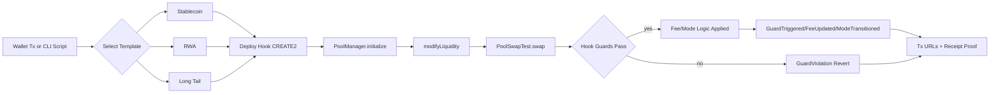
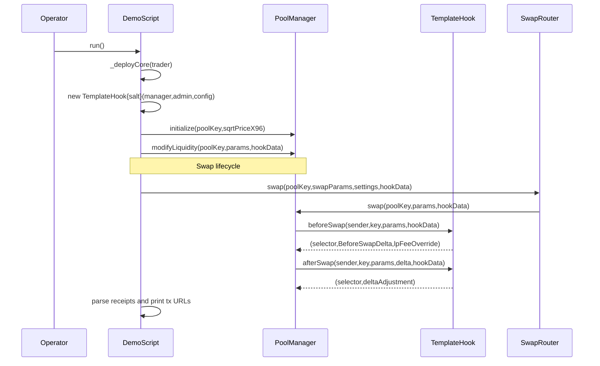

# Hook Templates
**Built on Uniswap v4 · Deployed on Unichain Sepolia**

_Targeting: Uniswap Foundation Prize · Unichain Prize_

> A reusable Uniswap v4 hook template suite for stablecoin, RWA, and long-tail markets, with deterministic deployment and on-chain policy enforcement on Unichain Sepolia.


-1f6feb)

## The Problem
Specialized markets need swap-time policy controls, but static AMM configuration cannot react to market states like depeg stress, session windows, or launch volatility. Without hook-level enforcement, these controls move off-chain or into manual operations.

| Layer | Failure Mode |
|---|---|
| Stablecoin pools | Static fee tiers underprice depeg and volatility shocks |
| RWA pools | Permission/session policy leaks into off-chain process |
| Long-tail launches | Early blocks are exposed to sniping and toxic flow |
| Operations | Config changes and guardrails become ad hoc and non-deterministic |

These failures convert market policy errors into LP loss, user slippage, and governance risk.

## The Solution
The system enforces market-specific policy directly in Uniswap v4 core hook functions.

1. Deploy template hooks with permission bits mined into hook address via CREATE2.
2. Bind each hook to exactly one `PoolId` on first `afterInitialize`.
3. Enforce shared guardrails in `beforeSwap`: max trade, rate limit, cooldown.
4. Apply template-specific logic per swap:
   1. Stablecoin: deviation/volatility fee bands + circuit-breaker-lite.
   2. RWA: session window + sender allowlist + tick/slippage bounds.
   3. Long-tail: launch-mode fee and trade caps with transition to normal.
5. Update guard state in `afterSwap` and emit standardized analytics events.
6. Stage and apply config updates through hash+delay controls.

Core insight: policy belongs in deterministic swap callbacks, not off-chain operators.

## Architecture

### Component Overview
```text
src/
  factory/
    TemplateFactory.sol
      - Mines CREATE2 salts and deploys template hooks with standardized events.
  framework/
    BaseTemplateHook.sol
      - Shared hook permissions, pool binding, admin controls, and guard staging.
    TemplateTypes.sol
      - Canonical config/state structs for all templates.
    TemplateGuards.sol
      - Reusable guardrail library: max trade, rate limits, cooldown, sessions.
    TemplateEvents.sol
      - Standardized analytics events across templates.
    TemplateErrors.sol
      - Standardized custom errors across templates.
  hooks/
    StablecoinTemplateHook.sol
      - Dynamic fee bands and circuit-breaker-lite for depeg/volatility paths.
    RWATemplateHook.sol
      - Sessioned and permissioned swap policy with tick/slippage controls.
    LongTailTemplateHook.sol
      - Launch-phase decay policy and mode transition to normal trading.
scripts/
  demo_e2e.sh
    - End-to-end deploy/report runner with tx URL and receipt proof output.
  generate_deployments_md.sh
    - Regenerates address/tx registry from latest broadcasts.
  generate_demo_report.sh
    - Regenerates markdown proof artifact for judges.
test/
  *.t.sol
    - Unit, edge, fuzz/invariant, and lifecycle integration suites.
docs/
  *.md
    - Architecture, security, deployment, testing, and API documentation.
```

### Architecture Flow (Subgraphs)


### User Perspective Flow


### Interaction Sequence


## Policy Regime Engine
| Template | Mode / Stage | Entry Condition | Exit Condition | On-Chain Behavior |
|---|---|---|---|---|
| Stablecoin | Normal | `deviation < stressDeviation` | Deviation or volatility rises | `normalFee` override |
| Stablecoin | Stress | `deviation >= stressDeviation` or volatility spike | Deviation falls | `stressFee` override + guard events |
| Stablecoin | Circuit | `deviation >= circuitBreakerDeviation` | `cooldownSeconds` elapsed | Temporary block/reprice path |
| RWA | Session Open | `TemplateGuards.inSession(...) == true` | Session closes | Swaps allowed if sender allowlisted |
| RWA | Session Closed | Outside configured window | Session opens | Revert `RWA_SESSION_CLOSED` |
| Long-Tail | Launch Mode | Contract deployment time | Time or volume transition reached | Decaying launch fee + launch trade caps |
| Long-Tail | Normal Mode | `_shouldTransitionToNormal() == true` | N/A | `normalFee` and relaxed caps |

`LongTailTemplateHook` transitions to normal mode by either elapsed launch duration or cumulative traded volume, so liquidity bootstrapping can complete by time or demand.

## Deployed Contracts

### Unichain Sepolia (chainId: 1301)
| Contract | Address |
|---|---|
| Uniswap v4 PoolManager (canonical) | [`0x00b036b58a818b1bc34d502d3fe730db729e62ac`](https://sepolia.uniscan.xyz/address/0x00b036b58a818b1bc34d502d3fe730db729e62ac) |
| StablecoinTemplateHook | [`0xaf3139361f74e4c46f6782eec04c766d50fc90c0`](https://sepolia.uniscan.xyz/address/0xaf3139361f74e4c46f6782eec04c766d50fc90c0) |
| RWATemplateHook | [`0xaf24cb89bb21f57e1fa594956203ccb6c2b210c0`](https://sepolia.uniscan.xyz/address/0xaf24cb89bb21f57e1fa594956203ccb6c2b210c0) |
| LongTailTemplateHook | [`0x7d77e422f59d7afbc0fed4e78d87d29e465e90c0`](https://sepolia.uniscan.xyz/address/0x7d77e422f59d7afbc0fed4e78d87d29e465e90c0) |
| Stable PoolSwapTest | [`0xf7c25e78b9a7a74f28aaf1e28a4d85756a80576a`](https://sepolia.uniscan.xyz/address/0xf7c25e78b9a7a74f28aaf1e28a4d85756a80576a) |
| Stable PoolModifyLiquidityTest | [`0xdc56844cc6d989f318a24d0a18f2e6ce85a60198`](https://sepolia.uniscan.xyz/address/0xdc56844cc6d989f318a24d0a18f2e6ce85a60198) |
| RWA PoolSwapTest | [`0xe936e3d854ac407e2a6930f8db49ddf987db0909`](https://sepolia.uniscan.xyz/address/0xe936e3d854ac407e2a6930f8db49ddf987db0909) |
| RWA PoolModifyLiquidityTest | [`0xd4540f5b5a744517a92f27c4f9ae4eee875fc763`](https://sepolia.uniscan.xyz/address/0xd4540f5b5a744517a92f27c4f9ae4eee875fc763) |
| Long-Tail PoolSwapTest | [`0x9e50198690fdcc962874ded19316e108c0deffef`](https://sepolia.uniscan.xyz/address/0x9e50198690fdcc962874ded19316e108c0deffef) |
| Long-Tail PoolModifyLiquidityTest | [`0xb4bab86a5ad3f700791f74dfdb7a5cd8886e638a`](https://sepolia.uniscan.xyz/address/0xb4bab86a5ad3f700791f74dfdb7a5cd8886e638a) |

## Live Demo Evidence
Demo run date: **2026-03-11**

### Phase 1 — Hook Deployment and Policy Setup
Network: **Unichain Sepolia (1301)**

| Action | Transaction |
|---|---|
| Stablecoin hook deploy | [`0xac536cea…`](https://sepolia.uniscan.xyz/tx/0xac536ceaccdd71ef5d5224c06248b0bf258220ab8557c77f7d62f571b32bb1b2) |
| RWA hook deploy | [`0xaae65100…`](https://sepolia.uniscan.xyz/tx/0xaae65100414391c4c5972caf8ff95adf78a445e34f6c935039a8b045a57f1b3f) |
| RWA allowlist setup | [`0x4f16ad10…`](https://sepolia.uniscan.xyz/tx/0x4f16ad104ec46478f5d705e6ad669cfe3346fe643e0a488ad2f07e0fcb1b4b4a) |
| Long-tail hook deploy | [`0xef1367e0…`](https://sepolia.uniscan.xyz/tx/0xef1367e0f0bd2fa6dcc1c0c85de347da876568b2ced48fcc87ca9a374164e4ce) |

### Phase 2 — Pool Initialization and Liquidity
Network: **Unichain Sepolia (1301)**

| Action | Transaction |
|---|---|
| Stablecoin pool initialize | [`0xfcf67b95…`](https://sepolia.uniscan.xyz/tx/0xfcf67b95035bca0349d612cb170e567a854f0bfb4a285ec8b57cfb84feb5c1bc) |
| Stablecoin add liquidity | [`0x431d9ceb…`](https://sepolia.uniscan.xyz/tx/0x431d9cebc3201dbc9cdba4d373d43bd2ec91ef5652ddb95551ea8e1133a69e43) |
| RWA pool initialize | [`0xe01c597c…`](https://sepolia.uniscan.xyz/tx/0xe01c597c7261ef5a7aee1269d9beb99845a6f1ea678f4e56797c206bd947dfbe) |
| RWA add liquidity | [`0x3f2ee21b…`](https://sepolia.uniscan.xyz/tx/0x3f2ee21b0ca6d9ef9528b5236bc4d56411bddf1d8f07a6b78326ae2234561a62) |
| Long-tail pool initialize | [`0xc5b2832b…`](https://sepolia.uniscan.xyz/tx/0xc5b2832ba9def9657f836a1d27767c04552513d8833e25dea6edbb493ba71ca1) |
| Long-tail add liquidity | [`0xd40f871a…`](https://sepolia.uniscan.xyz/tx/0xd40f871a787f54768da54ba97546bfc9f2e3bd458264811be8267f30c001a50d) |

### Phase 3 — Swap Execution and Hook Decisions
Network: **Unichain Sepolia (1301)**

| Action | Transaction |
|---|---|
| Stablecoin swap #1 | [`0x2c88fc1d…`](https://sepolia.uniscan.xyz/tx/0x2c88fc1df5ba3f76ca336a967f972e8b6ebb1e86b33afdb7d097da8373e44aaa) |
| Stablecoin swap #2 | [`0xef814dcf…`](https://sepolia.uniscan.xyz/tx/0xef814dcfddf1e2ff77be9333137d8ce21fa6e00233727d2ee00a2a3254cfd285) |
| Stablecoin swap #3 | [`0x483669b7…`](https://sepolia.uniscan.xyz/tx/0x483669b7e972552c9d505b561b6f88d72d067fc6fd57f26d917b93180c9269c3) |
| RWA swap #1 | [`0xc0820152…`](https://sepolia.uniscan.xyz/tx/0xc08201525d9825700b2c395e723ac2f7f443ab35a1d1a759686cd211ce631f1e) |
| RWA swap #2 | [`0x9b1f2ac6…`](https://sepolia.uniscan.xyz/tx/0x9b1f2ac6640ac1f8af8bef0f771e371ab6f62962e7813d5f639fdf92a602949b) |
| RWA swap #3 | [`0xb06fed9f…`](https://sepolia.uniscan.xyz/tx/0xb06fed9fbf5200278286a98a2bbeedf006ff696fe62b9f38d807b1a6a11de4b9) |
| Long-tail swap #1 | [`0xeaa0df68…`](https://sepolia.uniscan.xyz/tx/0xeaa0df6856489ee8a40be30a12016660c8682e4df0b53e5dd8afce496cb42104) |
| Long-tail swap #2 | [`0x9ffb38e8…`](https://sepolia.uniscan.xyz/tx/0x9ffb38e868b799ef0da8defa655c82b6d46b6fb270a706a9ba0d9193c503fc79) |
| Long-tail swap #3 | [`0x3d6afd9b…`](https://sepolia.uniscan.xyz/tx/0x3d6afd9bcab28a0188a4c33eae2c6de88ad5b0c60622ab25df6b185ff1dc47b5) |

> Note: aggregate guard/fee/mode evidence is read from transaction receipts by `scripts/demo_e2e.sh` and printed off-chain; the proof artifact is `docs/demo-proof.md`.

## Running the Demo
```bash
# Full testnet deployment + lifecycle run for all templates
bash scripts/demo_testnet.sh all deploy
```

```bash
# Regenerate deployment registry and markdown proof from latest run files
make deployments-docs && make demo-proof
```

```bash
# Stablecoin phase only
bash scripts/demo_testnet.sh stable deploy
# RWA phase only
bash scripts/demo_testnet.sh rwa deploy
# Long-tail phase only
bash scripts/demo_testnet.sh longtail deploy
```

```bash
# Local deterministic lifecycle run
bash scripts/demo_local.sh all deploy
```

## Test Coverage
```text
Lines:       100.00% (325/325)
Statements:   95.56% (344/360)
Branches:     72.13% (44/61)
Functions:   100.00% (69/69)
```

```bash
FOUNDRY_OFFLINE=true forge test
FOUNDRY_OFFLINE=true forge coverage --report summary --exclude-tests --no-match-coverage 'script/'
FOUNDRY_OFFLINE=true bash scripts/coverage_gate.sh
```

- Unit tests: template fee/mode/guard correctness and admin control paths.
- Edge tests: zero liquidity, limits, permission bit mismatch, event topics.
- Fuzz/invariant tests: guard invariants and non-regressive state transitions.
- Integration tests: full deploy -> initialize -> liquidity -> swap lifecycle.
- Factory tests: deterministic CREATE2 address mining and hook deployment.

## Repository Structure
```text
src/
  factory/
  framework/
  hooks/
  interfaces/
scripts/
test/
docs/
```

## Documentation Index
| Doc | Description |
|---|---|
| `docs/overview.md` | Project scope and system summary |
| `docs/architecture.md` | Hook architecture and component interactions |
| `docs/templates.md` | Stablecoin/RWA/Long-tail template behavior |
| `docs/template-authoring-guide.md` | How to implement a new hook template safely |
| `docs/security.md` | Threat model, mitigations, and trust boundaries |
| `docs/deployment.md` | Environment requirements and deployment workflow |
| `docs/deployments.md` | Generated on-chain deployment registry with tx proofs |
| `docs/demo.md` | Demo run guidance and latest tx evidence |
| `docs/demo-proof.md` | Full generated proof log from latest run |
| `docs/api.md` | Contract-level API reference |
| `docs/testing.md` | Test categories, methodology, and coverage guidance |

## Key Design Decisions

**Why bind each hook to one pool at first initialize?**  
`BaseTemplateHook._afterInitialize` stores `supportedPoolId` and rejects any later pool mismatch. This avoids policy bleed between pools and makes audit scope finite per hook instance.

**Why stage config updates with hash+delay?**  
`pendingConfigHash` and `pendingTemplateConfigHash` plus delay checks force deterministic, reviewable config transitions. Immediate writes were rejected because they increase admin key blast radius during incidents.

**Why use sender-based allowlist checks in RWA hooks?**  
`RWATemplateHook` checks the direct `sender` from `PoolManager.swap` instead of trusting `hookData`. This blocks identity spoofing and keeps authorization anchored to the actual swap caller.

**Why enforce canonical external PoolManager on testnet runs?**  
`scripts/demo_e2e.sh` now hard-fails if chain or `POOL_MANAGER_ADDRESS` checks fail, and scripts set `REQUIRE_EXTERNAL_POOL_MANAGER=true`. This prevents accidental local-manager fallback in production-like runs.

## Roadmap
- [ ] Add explicit emergency pause module with narrow scope and bounded authority.
- [ ] Add dedicated reentrancy-focused property tests across all hook callbacks.
- [ ] Add per-template gas benchmark baselines in CI artifacts.
- [ ] Add canonical periphery execution paths in demo flows (beyond test routers).
- [ ] Publish external security review report and remediation diffs.

## License
MIT (`LICENSE`).
