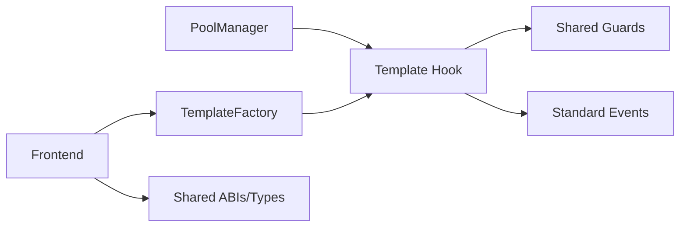

# Architecture

## Components
- `src/framework`: shared configs, errors, guards, events, base hook logic.
- `src/hooks`: concrete template hooks.
- `src/factory`: CREATE2 deployment + salt mining.
- `script`: Foundry scripts for deployment/demo.
- `scripts`: bootstrap/dependency/demo wrappers.
- `shared`: ABIs/types/constants used by frontend.
- `frontend`: launcher UI and execution feed.

## Hook Call Path
1. `PoolManager` routes core hook calls using permission bits encoded in hook address.
2. Hook enforces `onlyPoolManager`.
3. Hook applies shared guards + template-specific logic.
4. Hook returns optional dynamic fee override for dynamic-fee pools.

## Diagram

