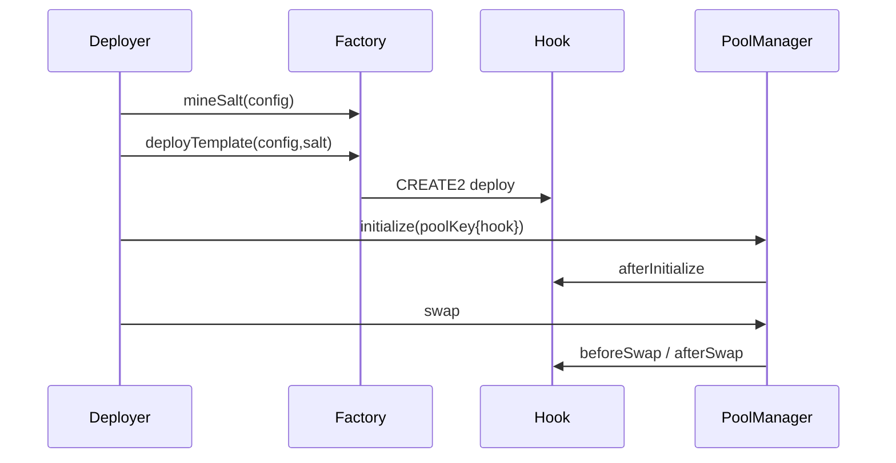

# Hook Templates Specification

## 1. Scope
Deliver a reusable Uniswap v4 hook template framework for specialized markets with:
- shared configuration and safety primitives
- three production-oriented reference templates (stablecoin, RWA, long-tail)
- deterministic deployment/demo flows
- frontend launcher and typed shared artifacts

## 2. Design Constraints
- Root Foundry layout: `src/`, `test/`, `script/`, `lib/`
- Frontend at `/frontend`
- Shared ABIs/types at `/shared`
- Deterministic dependency pins in submodules and lockfiles
- Hook permissions must match address bits
- Hook entrypoints must be callable only by `PoolManager`

## 3. Framework Components
### 3.1 Core Library
`src/framework/*`
- `TemplateTypes.sol`: base + template-specific config structs
- `TemplateGuards.sol`: rate-limit/cooldown/max-trade/session helpers
- `TemplateEvents.sol`: standardized analytics events
- `TemplateErrors.sol`: standardized error surface
- `BaseTemplateHook.sol`: common behavior for pool support checks, config update flow, fee override and shared guard orchestration

### 3.2 Standardized Events
- `TemplateDeployed`
- `ConfigUpdated`
- `GuardTriggered`
- `FeeUpdated`
- `ModeTransitioned`

### 3.3 Standardized Errors
- `Unauthorized`
- `InvalidConfig`
- `GuardViolation`
- `UnsupportedPool`
- `NotPoolManager` (inherited from Uniswap periphery `ImmutableState`)

## 4. Template Hooks
### 4.1 StablecoinTemplateHook
Goals:
- peg-aware fee response
- elevated fees under volatility spikes
- optional circuit-breaker-lite cooldown under extreme deviation

Core hook functions:
- `afterInitialize`
- `beforeSwap`
- `afterSwap`

### 4.2 RWATemplateHook
Goals:
- low-frequency market safety controls
- permissions and time-window constraints
- slippage/tick-jump boundaries

Core hook functions:
- `afterInitialize`
- `beforeSwap`
- `afterSwap`

### 4.3 LongTailTemplateHook
Goals:
- launch-phase anti-snipe/anti-volatility controls
- gradual transition to normal market mode
- segmented order-flow cap per block (optional)

Core hook functions:
- `afterInitialize`
- `beforeSwap`
- `afterSwap`

## 5. Factory
`src/factory/TemplateFactory.sol`
- mines salts with `HookMiner`
- deploys each template via CREATE2
- emits `TemplateDeployed`

## 6. Hook Permission Bits and Security Invariants
- Uniswap v4 PoolManager decides which core hook functions are called based on hook contract address bits.
- This repo uses flags for `afterInitialize`, `beforeSwap`, `afterSwap`.
- Every hook inherits `BaseHook` and is protected by `onlyPoolManager`.
- Unsupported pool usage reverts with `UnsupportedPool`.

## 7. Lifecycle

## 8. Testing Matrix
- Unit tests per template behavior
- Edge tests (zero liquidity, rate limits, max trade boundary, unauthorized updates, permission mismatch, event indexing)
- Fuzz tests (forbidden action rejection, config invariants, state transition monotonicity)
- Integration tests (end-to-end lifecycle per template)

## 9. Deployment & Demo
- Foundry scripts under `/script`
- Wrapper shell scripts under `/scripts` provide local/testnet demo commands and print tx hashes + explorer URLs from broadcast artifacts

## 10. Assumptions
Context is now available and reconciliation has been performed against:
- `/context/uniswap_docs/docs/docs/contracts/v4/concepts/hooks.mdx`
- `/context/uniswap_docs/docs/docs/contracts/v4/guides/hooks/hook-deployment.mdx`
- `/context/uniswap_docs/docs/docs/contracts/v4/guides/accessing-msg.sender-using-hook.mdx`
- `/context/HOOKS_QUICK_REFERENCE.md`
- `/context/REACTIVE_HOOKS_ARCHITECTURE.md`
- `/context/REACTIVE_HOOKS_ARCHITECTURE_PART2.md`

`context/uniswap_docs` is used as the effective `/context/uniswap` source bundle.
